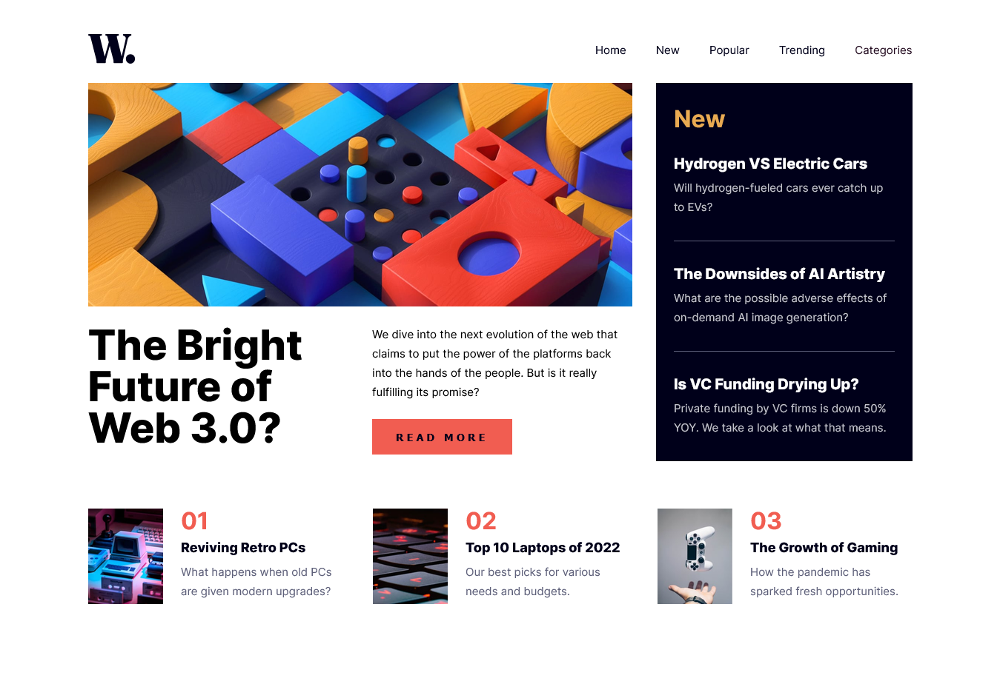
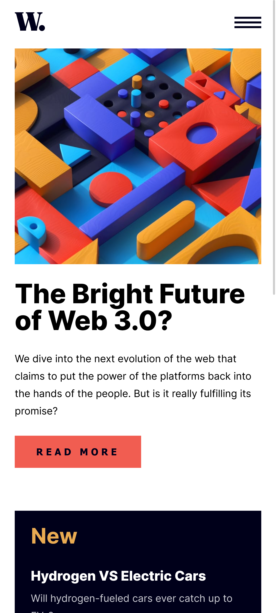

# Frontend Mentor - News homepage solution

This is a solution to the [News homepage challenge on Frontend Mentor](https://www.frontendmentor.io/challenges/news-homepage-H6SWTa1MFl). Frontend Mentor challenges help you improve your coding skills by building realistic projects. 

## Table of contents

- [Overview](#overview)
  - [The challenge](#the-challenge)
  - [Screenshot](#screenshot)
  - [Links](#links)
- [My process](#my-process)
  - [Built with](#built-with)
  - [What I learned](#what-i-learned)
  - [Continued development](#continued-development)
  - [AI Collaboration](#ai-collaboration)

## Overview

### The challenge

Users should be able to:

- View the optimal layout for the interface depending on their device's screen size
- See hover and focus states for all interactive elements on the page

### Screenshot

### Links

- Solution URL: https://github.com/Yahyaball/news-homepage-main
- Live Site URL: https://news-homepage-yahya.netlify.app

## My process

### Built with

- Semantic HTML5 markup
- CSS custom properties
- Flexbox
- CSS Grid
- Mobile-first workflow
- SCSS
- Pure JS

### What I learned

**Semantic HTML & accessibility before styling:**
- `div` is for layout only — it adds no meaning. I kept `div.section-1` and the `div.divider` inside `.hero` for Grid/Flex, but used landmarks `header` → `nav#primary-navigation` → `main` → `section`/`article` so screen readers can navigate by landmarks and heading outline.
- `article` vs `section`: `article` is self-contained (makes sense alone in an RSS feed) so each teaser and featured card is an `article`, while the hero, "New" group, and featured group are `section`s with `aria-labelledby`.
- Fixed heading hierarchy: `01`/`02`/`03` were `h2`s — changed to `span aria-hidden` + real `h3` titles, so the outline is `h1` → `h2` New → `h3`s. Also added descriptive `alt` for content images and `alt="" aria-hidden` for decorative icons, plus a `.visually-hidden` heading for the featured section.

**SCSS architecture:**
- Moved from one file to a simplified 7-1: `abstracts/_variables.scss` (colors from `style-guide.md`, spacing), `abstracts/_mixins.scss` (`text-preset-1` … `text-preset-7`), `base/_reset.scss` + `base/_typography.scss` (`@font-face` with `font-display: swap`), `layout/_grid.scss` + `layout/_header.scss` + `layout/_container.scss`, `components/_hero.scss` / `_new.scss` / `_featured.scss` / `_button.scss`, and `main.scss` that only `@use`s.
- Learned why `abstracts` must not output CSS, `base` is for bare elements (`html`, `body`, `img`), and `components` vs `layout` is *what it looks like* vs *where it sits*. Fixed `layout/_grid.scss` `2fr 1fr` (was `500px 500px` + `width:10rem` collapsing columns) and `base/_typography.scss` relative font path `../assets/fonts/...`.

**JS & a11y interaction:**
- Mobile drawer: `matchMedia`, toggling `nav.show` + `.overlay`, and using `inert` on `nav`/`main`/`logo` when open to hide background from AT.
- Focus management: `closeBtn.focus()` on open makes the screen reader instantly announce "Close menu", and `openBtn.focus()` on close returns focus. Also toggling `aria-expanded` on the controller (`#button-menu`) and supporting `Escape` + `overlay` click to close.
- Avoided `!important` in `components/_button.scss` by scoping the primary button to a class (`.btn`) instead of global `button`, so `header button` (more specific `header button`) no longer fights — learned specificity `0,0,2` vs `0,0,1`.

### Continued development

- Replace JS hero-image swap (`script.js` `matchMedia` for `image-web-3-mobile/desktop.jpg`) with `<picture><source media>` so the browser picks before JS loads and avoids flash/layout shift.
- Add full focus trap inside the open `nav` (`Tab` stays in the drawer) and `prefers-reduced-motion` already added for `nav`/`overlay` transitions — next is `focus-visible` styles for all `a`/`button` (`:hover` already done).
- Clean JS: remove `let expanded` flag and use `nav.classList.contains("show")` as single source of truth, fix Range Syntax `"(width < 80rem)"` to `"(max-width: 79.99rem)"` for Safari 16 support, and add body scroll lock when drawer is open.
- Explore a `text-preset` function + mixin with a `$presets` map (and `clamp()` for fluid type) so new presets require only a map entry, not mixin edits.

### AI Collaboration

- **Tool:** [OpenCode](https://opencode.ai) with `opencode/muse-spark-1.2-contributor-free` (Muse Spark 1.2 Free) — used as a **supportive guide, not a code generator**.
- Used it to understand concepts (when `div` is correct for styling, `article` vs `section`, SCSS 7-1 structure, `base.scss` purpose, font export placement, `text-preset` mixin + function) and got hints + "why" explanations instead of copy-paste solutions.
- Practiced guided debugging: OpenCode pointed to DevTools Accessibility pane, Computed styles, and `console.log(document.activeElement)` to trace why `layout/_grid.scss` collapsed (`width:10rem`) and why focus wasn't moving to the Close button.
- After I built HTML/CSS/JS myself, I asked OpenCode (Muse Spark 1.2 Free) for an evaluation against best practices (landmarks, heading outline, `!important`, `aria-expanded` + `inert`, Range Syntax). I then requested targeted fixes (grid `2fr 1fr`, font path `../assets/fonts/...`, `closeBtn.focus()` / `openBtn.focus()`, removing `!important` by scoping to `.btn`) and applied them myself, keeping ownership of the code.
